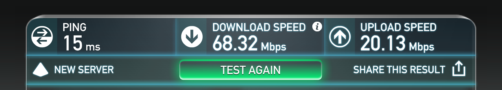
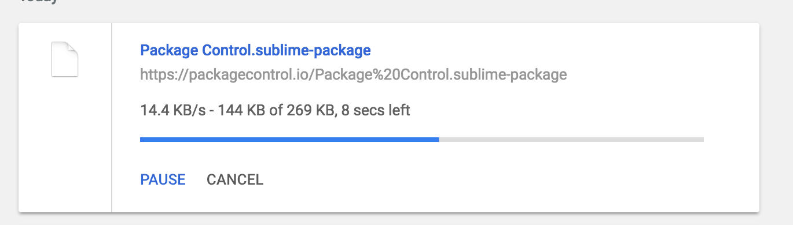
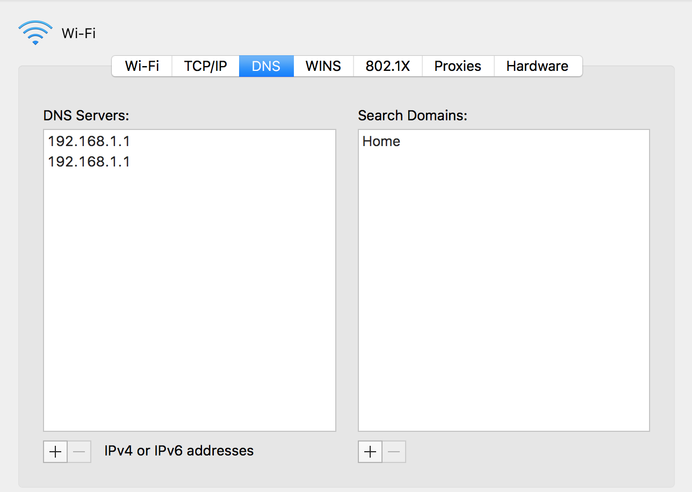
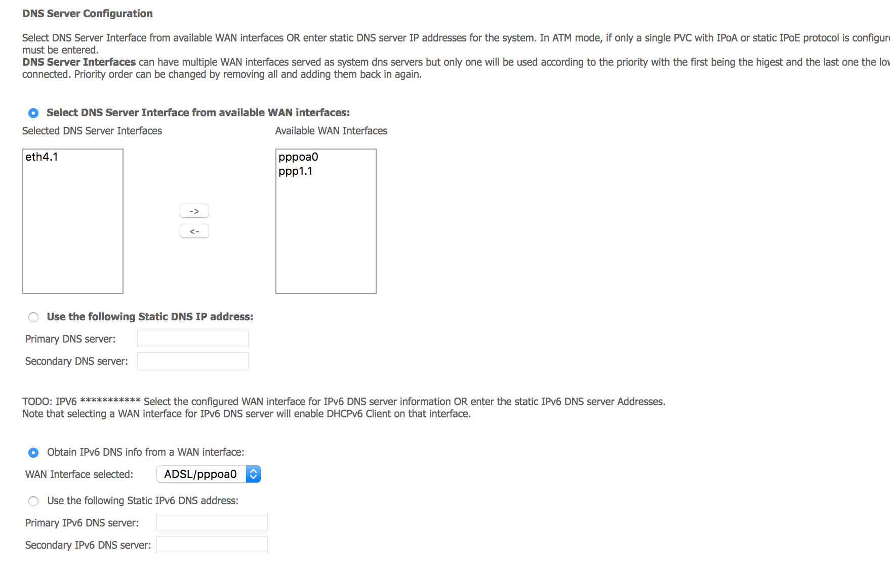

Internet Speed Investigation
============================

Dear Orcon,

Thanks for your email containing speed test instructions.  I've run the test and the results are, well... excellent actually. :rocket:



Unfortunately, non-speed-test internet usage is still really slow in certian circumstances and I need assistance getting to the bottom of the problem.

## The Problem

Real world internet usage is very slow.  One example that keeps occuring is when downloading files over http / https the speed becomes very slow.

As an example, this evening I tried to download a 106MB file from `download.docker.com`.


Here is the `traceroute download.docker.com` output

```
traceroute: Warning: download.docker.com has multiple addresses; using 52.84.207.57
traceroute to d2h67oheeuigaw.cloudfront.net (52.84.207.57), 64 hops max, 52 byte packets
 1  orcon.home (192.168.1.1)  2.683 ms  1.622 ms  1.848 ms
 2  * * *
 3  ext.cpcak4-r1.tranzpeer.net (101.98.0.66)  18.785 ms  3.942 ms  3.972 ms
 4  pts-s.cpcak4-r1.tranzpeer.net (101.98.5.21)  5.189 ms  8.731 ms  6.742 ms
 5  4610.syd.equinix.com (45.127.172.93)  30.949 ms  31.344 ms  30.890 ms
 6  16509.syd.equinix.com (45.127.172.131)  32.581 ms  35.290 ms  32.075 ms
 7  52.95.36.114 (52.95.36.114)  35.740 ms
    52.95.36.34 (52.95.36.34)  48.977 ms
    52.95.36.98 (52.95.36.98)  40.920 ms
 8  52.95.36.23 (52.95.36.23)  31.145 ms  32.988 ms
    52.95.36.85 (52.95.36.85)  30.280 ms
 9  54.240.192.137 (54.240.192.137)  37.484 ms
    54.240.192.151 (54.240.192.151)  37.683 ms
    54.240.192.137 (54.240.192.137)  41.331 ms
10  * * *
11  * * *
12  * * *
13  server-52-84-207-57.syd1.r.cloudfront.net (52.84.207.57)  58.586 ms  30.898 ms  34.508 ms
```

### Is it the server that's slow?
One screenshot of one poorly performing download doesn't really prove much, it could be the server at the other end right?

Luckily I have a spare AWS EC2 instance in the Amazon Sydney datacenter that I could test the same download with.

`wget https://download.docker.com/mac/stable/Docker.dmg`

```
--2017-01-07 07:20:01--  https://download.docker.com/mac/stable/Docker.dmg
Resolving download.docker.com (download.docker.com)... 52.84.207.57, 52.84.207.70, 52.84.207.114, ...
Connecting to download.docker.com (download.docker.com)|52.84.207.57|:443... connected.
HTTP request sent, awaiting response... 200 OK
Length: 111169735 (106M) [binary/octet-stream]
Saving to: ‘Docker.dmg’

Docker.dmg                               100%[=================================================================================>] 106.02M  29.4MB/s    in 3.7s    

2017-01-07 07:20:05 (29.0 MB/s) - ‘Docker.dmg’ saved [111169735/111169735]
```

`29.0MB/s` is about what I expected given that we're dealing with `cloudfront.net`, this kind of suggests that it's probably not the server at the other end being slow.

Traceroute from EC2 instance to `download.docker.com`

```
traceroute download.docker.com
traceroute to download.docker.com (52.84.207.70), 30 hops max, 60 byte packets
 1  ec2-54-252-0-130.ap-southeast-2.compute.amazonaws.com (54.252.0.130)  13.599 ms ec2-54-252-0-128.ap-southeast-2.compute.amazonaws.com (54.252.0.128)  21.818 ms  21.808 ms
 2  100.64.1.140 (100.64.1.140)  11.658 ms 100.64.1.200 (100.64.1.200)  19.571 ms 100.64.0.76 (100.64.0.76)  14.049 ms
 3  100.64.1.69 (100.64.1.69)  18.263 ms 100.64.3.3 (100.64.3.3)  16.647 ms 100.64.1.3 (100.64.1.3)  16.648 ms
 4  100.64.17.229 (100.64.17.229)  0.881 ms 100.64.17.135 (100.64.17.135)  0.792 ms 100.64.16.165 (100.64.16.165)  0.969 ms
 5  52.95.38.18 (52.95.38.18)  2.044 ms 52.95.38.16 (52.95.38.16)  1.824 ms  2.663 ms
 6  52.95.36.62 (52.95.36.62)  1034.918 ms 52.95.36.94 (52.95.36.94)  1071.672 ms 52.95.36.62 (52.95.36.62)  1034.075 ms
 7  52.95.36.101 (52.95.36.101)  1.730 ms 52.95.36.21 (52.95.36.21)  1.603 ms 52.95.36.53 (52.95.36.53)  4.595 ms
 8  54.240.192.137 (54.240.192.137)  1.456 ms  1.507 ms  1.385 ms
 9  * * *
10  * * *
11  * * *
12  server-52-84-207-70.syd1.r.cloudfront.net (52.84.207.70)  1.259 ms  1.231 ms  1.191 ms
```

### Download same file from my EC2 instance

OK, so I actually needed this file and I wasn't keen on 40Kbps downloading it directly from the source so I `scp`'d it down from my EC2 instance.

```
scp ubuntu@<ec2host-address>:~/tmp/Docker.dmg .
100%  106MB   5.3MB/s   00:20 
```

It arrived at `5.3MB/s` - yay

## So this was just a one off right?

Nope, I next had to download another file.



Same deal, then I had to upgrade a linux server here and it had to download packages from the archives and it took forever with similar speeds. :snail:

There is certianly something strange going on here and the speed tests are not reflecting it.  I sometimes resort to tethering off my phone for these slow downloads when I really need the file in a hurry.


## Could it be DNS?

Ok, so my local machine's DNS is set to the router



The router DNS settings are as follows.




## What could it be?

#### Too many devices connected here using too much bandwidth?

We have on average 2 laptops and 2 phons connected in the evenings, I only had the laptop connected when running these tests.  Also, from sources with a "good" connection, e.g. copying files with scp from AWS I get very good speeds through WiFi at home.  The speed test at the top was also run on WiFi.  Earlier, I ran the speed test through ethernet and it slammed the needle to 100mb/s, I'm certianly not disputing the speed of the pipe! :thumbsup:

#### Servers are slow?

Unlikely as I can download very fast form other locations

#### Congestion in Orcon's network?

Seems too intermittent to be you guys getting congested?

#### Some routing issue upstream from Orcon's network?

Are you guys aware of any issues at the moment?  Are there any tests I could run to help you find out?

#### Traffic shaping

Not unless you guys have changed your policy lately :sunglasses:
https://www.orcon.net.nz/about/article/orcons_unlimited_broadband_is_unlimited_truly


## Where to from here?

Could you guys please get in touch and let me know if there is anything I can do to help with regard to further tests to help you guys track down what the issue is.


Cheers,

Matt


