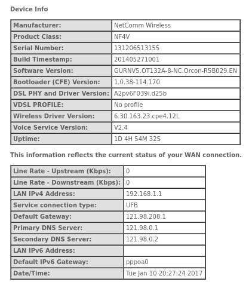
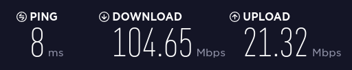
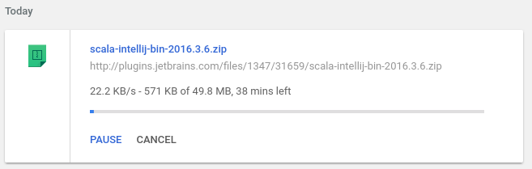
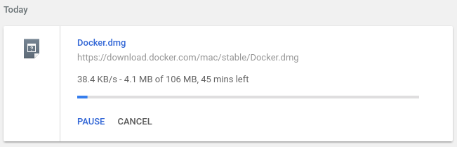
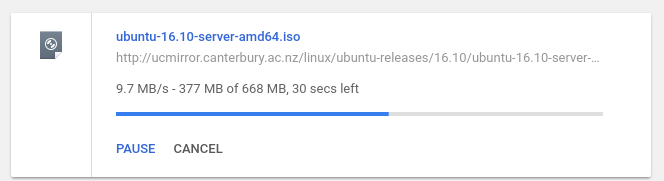
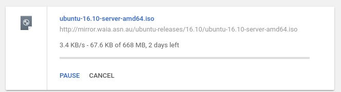
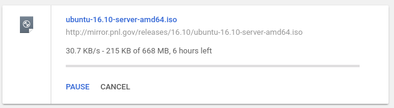

Internet Speed Investigation 2
==============================

[First Speed Test Investigation](README.md)

### Tickets
- Initial Ticket `#12729276`
- Followup Ticket `#12733152`

### Updates
Spoke to the support team in the call center today and they advised that I should try setting the router DNS settings to the following static IP addresses.
- `121.98.0.1`
- `121.98.0.2`

#### Router DNS Settings



#### DNS settings on my local machine
```
matt@matt-desktop:~$ nmcli device show enp4s0 | grep DNS
IP4.DNS[1]:                             121.98.0.1
IP4.DNS[2]:                             121.98.0.2
```

### Speed Test
The last speed test was run on my MacBook Pro over WiFi.  Today I'm testing on my Linux Desktop which has a wired 1000Mbps ethernet.



Dope :sunglasses:

### But download something over HTTP



```
matt@matt-desktop:~$ date
Tue Jan 10 18:48:28 NZDT 2017
matt@matt-desktop:~$ traceroute plugins.jetbrains.com
traceroute to plugins.jetbrains.com (54.247.185.248), 30 hops max, 60 byte packets
 1  gateway (10.1.1.1)  0.222 ms  0.307 ms  0.402 ms
 2  192.168.1.1 (192.168.1.1)  1.789 ms  1.879 ms  1.921 ms
 3  * * *
 4  ext.cpcak4-r1.tranzpeer.net (101.98.0.66)  7.007 ms  7.066 ms  7.000 ms
 5  pts-s.cpcak4-r1.tranzpeer.net (101.98.5.21)  7.070 ms  7.175 ms  7.149 ms
 6  bundle-100.bdr02.akl05.akl.vocus.net.nz (175.45.102.65)  8.371 ms  137.893 ms  4.067 ms
 7  bundle-10.cor01.akl05.akl.VOCUS.net.nz (114.31.202.100)  128.135 ms  128.106 ms  128.057 ms
 8  bundle-200.cor02.lax01.ca.VOCUS.net (114.31.202.47)  128.287 ms  128.071 ms  128.045 ms
 9  bundle-102.bdr02.lax01.ca.vocus.net (49.255.255.15)  128.248 ms  128.268 ms  132.559 ms
10  v301.core1.lax2.he.net (64.62.151.125)  128.024 ms  128.070 ms  131.722 ms
11  100ge2-2.core1.lax1.he.net (72.52.92.121)  131.791 ms  131.650 ms  131.620 ms
12  100ge12-1.core1.ash1.he.net (184.105.80.201)  186.393 ms  186.496 ms  186.442 ms
13  100ge12-1.core1.par2.he.net (184.105.213.174)  269.901 ms  269.931 ms  269.910 ms
14  * * *
15  * * *
16  * * *
17  176.32.106.240 (176.32.106.240)  276.933 ms 176.32.106.226 (176.32.106.226)  274.970 ms 176.32.106.240 (176.32.106.240)  278.511 ms
18  176.32.106.223 (176.32.106.223)  277.092 ms *  275.557 ms
19  * * *
20  * * *
21  * * *
22  * * *
23  * * *
24  * * *
25  * * *
26  * * *
27  * * *
28  * * *
29  * * *
30  * * *
```

### Let's try the download from yesterday again



```
matt@matt-desktop:~$ date
Tue Jan 10 20:38:47 NZDT 2017
matt@matt-desktop:~$ traceroute download.docker.com
traceroute to download.docker.com (52.84.207.225), 30 hops max, 60 byte packets
 1  gateway (10.1.1.1)  0.298 ms  0.342 ms  0.440 ms
 2  192.168.1.1 (192.168.1.1)  1.789 ms  1.795 ms  1.863 ms
 3  * * *
 4  ext.cpcak4-r1.tranzpeer.net (101.98.0.66)  6.758 ms  6.760 ms  6.797 ms
 5  pts-s.cpcak4-r1.tranzpeer.net (101.98.5.21)  6.988 ms  6.969 ms  6.966 ms
 6  4610.syd.equinix.com (45.127.172.93)  29.987 ms  26.903 ms  66.869 ms
 7  16509.syd.equinix.com (45.127.172.131)  27.719 ms  27.765 ms  27.805 ms
 8  52.95.36.66 (52.95.36.66)  35.820 ms 52.95.36.98 (52.95.36.98)  35.152 ms 52.95.36.34 (52.95.36.34)  28.345 ms
 9  52.95.36.103 (52.95.36.103)  32.565 ms 52.95.36.39 (52.95.36.39)  32.676 ms  32.932 ms
10  54.240.192.151 (54.240.192.151)  29.194 ms 54.240.192.137 (54.240.192.137)  28.516 ms 54.240.192.151 (54.240.192.151)  29.114 ms
11  * * *
12  * * *
13  * * *
14  server-52-84-207-225.syd1.r.cloudfront.net (52.84.207.225)  31.426 ms  31.780 ms  31.625 ms
```

### Let's download the same file from mirrors in various locations

I picked a 668MB Ubuntu Linux Server ISO

```
matt@matt-desktop:~$ date
Tue Jan 10 20:38:47 NZDT 2017
```

##### New Zealand



```
matt@matt-desktop:~$ traceroute ucmirror.canterbury.ac.nz
traceroute to ucmirror.canterbury.ac.nz (132.181.7.179), 30 hops max, 60 byte packets
 1  gateway (10.1.1.1)  0.229 ms  0.348 ms  0.455 ms
 2  192.168.1.1 (192.168.1.1)  1.842 ms  1.856 ms  1.945 ms
 3  * * *
 4  ext.cpcak4-r1.tranzpeer.net (101.98.0.66)  6.525 ms  6.530 ms  6.648 ms
 5  default-rdns.vocus.co.nz (101.98.19.122)  15.412 ms  15.453 ms  15.506 ms
 6  TenGigabitEthernet0-3-0-2202.aktnz-rt1.fx.net.nz (131.203.240.205)  14.542 ms  14.002 ms  10.519 ms
 7  131.203.240.206 (131.203.240.206)  14.886 ms  14.981 ms  14.920 ms
 8  210.7.37.89 (210.7.37.89)  28.440 ms  28.323 ms  28.373 ms
 9  210.7.37.90 (210.7.37.90)  28.523 ms  28.586 ms  28.526 ms
10  202.36.179.100 (202.36.179.100)  29.921 ms  29.962 ms  29.854 ms
11  132.181.3.236 (132.181.3.236)  28.544 ms *  26.331 ms
12  132.181.7.179 (132.181.7.179)  25.627 ms !X  28.129 ms !X  28.046 ms !X
```

##### Australia



```
matt@matt-desktop:~$ traceroute mirror.waia.asn.au
traceroute to mirror.waia.asn.au (218.100.43.30), 30 hops max, 60 byte packets
 1  gateway (10.1.1.1)  0.228 ms  0.331 ms  0.425 ms
 2  192.168.1.1 (192.168.1.1)  1.823 ms  1.862 ms  1.952 ms
 3  * * *
 4  ext.cpcak4-r1.tranzpeer.net (101.98.0.66)  3.475 ms  3.517 ms  3.558 ms
 5  pts-s.cpcak4-r1.tranzpeer.net (101.98.5.21)  4.096 ms  4.135 ms  4.174 ms
 6  as4610.nsw.ix.asn.au (218.100.52.94)  30.890 ms  29.348 ms  27.409 ms
 7  as10084.nsw.ix.asn.au (218.100.52.200)  27.653 ms  27.797 ms  27.831 ms
 8  103.2.119.138 (103.2.119.138)  74.561 ms  74.726 ms  74.656 ms
 9  103.2.119.155 (103.2.119.155)  79.107 ms  79.140 ms  79.160 ms
10  * * *
11  * * *
12  * * *
13  * * *
14  * * *
15  * * *
16  * * *
17  * * *
18  * * *
19  * * *
20  * * *
21  * * *
22  * * *
23  * * *
24  * * *
25  * * *
26  * * *
27  * * *
28  * * *
29  * * *
30  * * *
```

##### USA



```
matt@matt-desktop:~$ traceroute mirror.pnl.gov
traceroute to mirror.pnl.gov (192.101.102.2), 30 hops max, 60 byte packets
 1  gateway (10.1.1.1)  0.218 ms  0.293 ms  0.383 ms
 2  192.168.1.1 (192.168.1.1)  1.841 ms  1.849 ms  1.893 ms
 3  * * *
 4  ext.cpcak4-r1.tranzpeer.net (101.98.0.66)  7.003 ms  6.890 ms  6.891 ms
 5  pts-s.cpcak4-r1.tranzpeer.net (101.98.5.21)  7.545 ms  7.561 ms  7.206 ms
 6  bundle-100.bdr02.akl05.akl.vocus.net.nz (175.45.102.65)  8.595 ms * *
 7  bundle-10.cor01.akl05.akl.VOCUS.net.nz (114.31.202.100)  129.550 ms  128.869 ms  129.514 ms
 8  bundle-200.cor02.lax01.ca.VOCUS.net (114.31.202.47)  128.646 ms  128.640 ms bundle-50.cor01.alb01.akl.VOCUS.net.nz (114.31.202.86)  129.759 ms
 9  bundle-200.cor01.lax01.ca.VOCUS.net (114.31.202.45)  129.731 ms 100G-0-1-0-0.cor01.lax01.ca.vocus.net (49.255.255.7)  128.241 ms  128.749 ms
10  bundle-101.bdr01.lax01.ca.vocus.net (49.255.255.9)  129.954 ms  129.391 ms  129.957 ms
11  hurricane-electric.as6939.any2ix.coresite.com (206.72.210.122)  128.699 ms  141.048 ms  141.053 ms
12  100ge2-2.core1.lax1.he.net (72.52.92.121)  132.768 ms  128.460 ms  128.206 ms
13  10ge7-5.core1.sjc2.he.net (72.52.92.70)  139.885 ms  139.620 ms 100ge14-1.core1.sjc2.he.net (184.105.223.249)  139.308 ms
14  esnet.10gigabitethernet2-4.core1.sjc2.he.net (66.220.6.250)  141.220 ms  138.347 ms  138.597 ms
15  * * *
16  sacrcr5-ip-a-sunncr5.es.net (134.55.40.5)  141.069 ms  141.557 ms  141.049 ms
17  pnwgcr5-ip-a-sacrcr5.es.net (134.55.43.21)  158.665 ms  158.388 ms  158.738 ms
18  198.129.77.18 (198.129.77.18)  164.373 ms  164.618 ms  164.293 ms
19  brd-emsl-658.pnl.gov (192.35.193.162)  164.412 ms  164.233 ms  164.728 ms
20  mirror.pnl.gov (192.101.102.2)  165.553 ms  165.427 ms  165.331 ms
```

### Results

NZ speeds are excellent, I don't necessarily expect international traffic to saturate the 100Mbps pipe but at `30KBps` it's a little frustrating.

I would really appreciate some help improving the international speed to something workable.  Could you please get in touch to advise the next steps.

Email is my preferred method of contact as the call center audio quality isn't greate and it's hard to understand what's being said.  Staff are nice, just audio quality :thumbsup:


Cheers,

Matt

